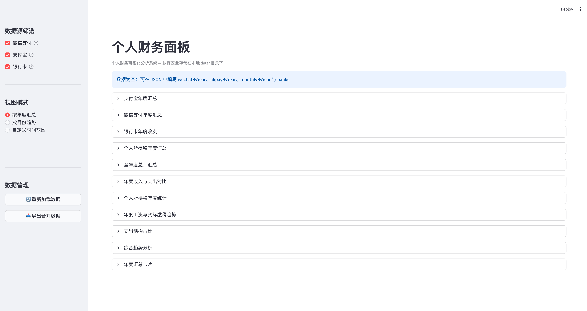

# 个人财务面板

基于 Python Streamlit + Plotly + Pandas 构建的个人财务可视化分析系统。



## 特点

- **去中心化数据架构** — 财务数据以 JSON 文件形式按来源（微信、支付宝、银行卡、个税）独立存储，存放在 `data/` 目录下，无后端，无上传
- **交互式图表** — 基于 Plotly 的交互式可视化：缩放、hover 详情、图例切换、多维度分析
- **多维分析视图** — 年度汇总、月度趋势、自定义时间范围三种分析模式
- **灵活数据源筛选** — 可动态切换微信 / 支付宝 / 银行卡三个渠道，解决跨渠道重复计算问题
- **在线编辑与导出** — 界面中直接维护各年度数据，支持导出合并后的 JSON

## 技术栈

Python 3.12 · Streamlit · Plotly · Pandas

## 快速开始

```bash
# 安装依赖
uv sync

# 启动开发服务器
uv run streamlit run src/finance_panel/app.py

## 项目结构

```
src/
└── finance_panel/
    ├── __init__.py
    ├── __main__.py               # python -m finance_panel 入口
    ├── app.py                    # Streamlit 主入口，页面配置、状态初始化、视图路由
    ├── types.py                  # 核心数据类型（dataclass）
    ├── format.py                 # CNY 货币格式化
    ├── data_loader.py            # 数据引擎：加载、解析、合并、导出 JSON
    ├── views/
    │   ├── annual.py             # 年度汇总视图（7 个图表区块）
    │   ├── monthly.py            # 月度趋势视图（3 个图表区块）
    │   └── range_view.py         # 自定义范围视图（5 个图表区块）
    └── components/
        ├── sidebar.py            # 侧边栏：数据源筛选、视图切换、年份/范围选择器
        ├── data_editor.py        # 可折叠数据编辑器
        └── chart_utils.py        # 共享图表工具：配色、布局、辅助函数
data/                             # 数据文件（JSON，gitignore）
```

## 数据格式

数据目录结构如下：

```
data/
├── wechat.json          # 微信支付月度数据
├── alipay.json          # 支付宝月度数据
├── tax.json             # 个人所得税年度数据
└── banks/               # 各银行卡数据（每个银行一个文件）
    ├── 招商银行.json
    └── 工商银行.json
```

所有文件顶层需包含 `"version": 1`。收入/支出按月度记录，系统自动汇总年度总值。

### wechat.json / alipay.json

按月记录各渠道收支，结构一致：

`data/wechat.json`:
```json
{
  "version": 1,
  "monthlyByYear": {
    "2024": {
      "wechat": {
        "1": { "income": 2251.23, "expense": 1972.48 },
        "2": { "income": 5249.85, "expense": 1926.29 },
        "3": { "income": 28.00, "expense": 1057.20 }
      }
    }
  }
}
```

`data/alipay.json`:
```json
{
  "version": 1,
  "monthlyByYear": {
    "2024": {
      "alipay": {
        "1": { "income": 0, "expense": 473.37 },
        "2": { "income": 7000, "expense": 2362.54 }
      }
    }
  }
}
```

- 月份键为 `"1"` 到 `"12"`
- 年度总值由系统自动从月度数据汇总，无需手动填写

### tax.json

记录年度工资收入和个税信息：

```json
{
  "version": 1,
  "taxByYear": {
    "2024": {
      "income": 23200,
      "taxPaid": 1760,
      "taxRefund": 1760
    }
  }
}
```

- `income` — 年收入合计（工资口径）
- `taxPaid` — 已申报税额
- `taxRefund` — 退税金额

### banks/*.json

每个银行一个文件，底层按月记录收入/支出：

```json
{
  "version": 1,
  "banks": [
    {
      "label": "招商银行",
      "year": 2024,
      "monthly": {
        "1": { "income": 5000, "expense": 3200.5 },
        "2": { "income": 4800, "expense": 2800.3 }
      }
    }
  ]
}
```

- `label` — 银行名称，用于图表展示
- 如果某年没有月度明细，也可以用 `"income"` 和 `"expense"` 直接记录年度总值

## 隐私

所有数据存储在浏览器本地和 `data/` 目录中，不涉及任何网络上传行为。
